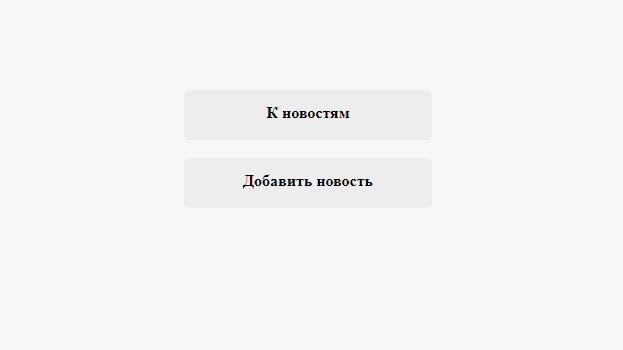
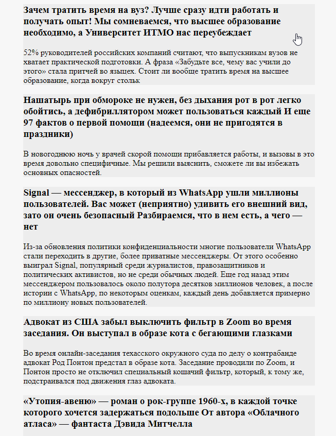
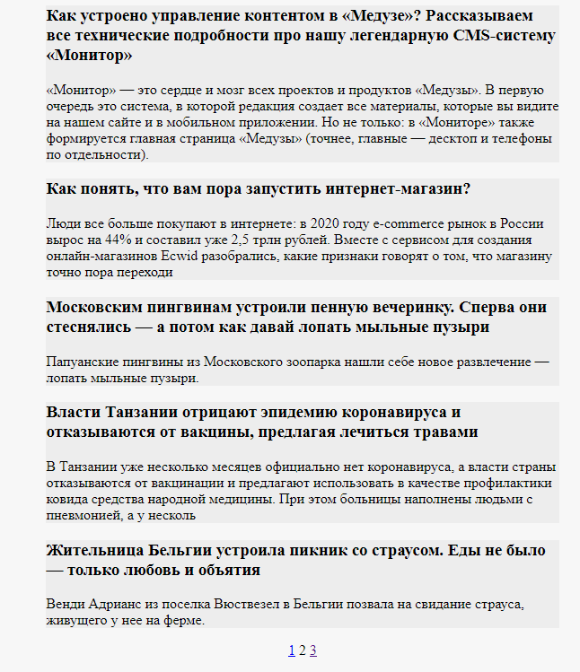
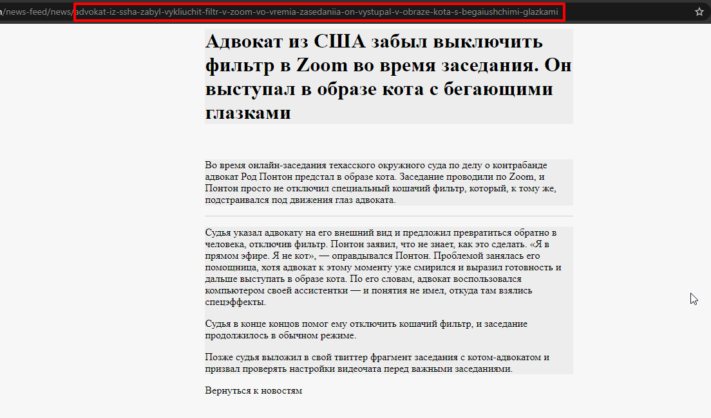
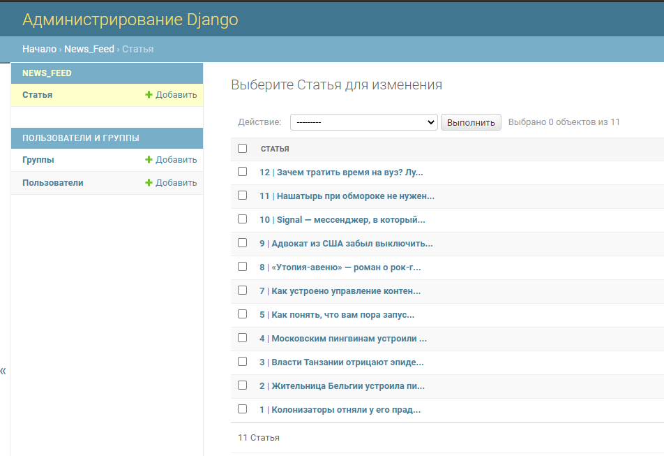
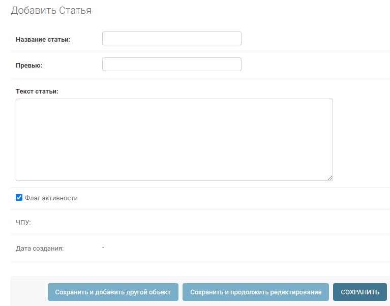

# Новостная лента

## Функционал

    1) Вывод последних новостей на странице с пагинацией
    2) Страница для каждой новости с использованием ЧПУ (или другими словами - slug)
    3) Добавление новостей из админки

# Демонстрация

Для демонатрации проект был развёрнут на heroku: [meduza-news.herokuapp.com](https://meduza-news.herokuapp.com/).

За основу был взят сайт [meduza.io](https://meduza.io).

## Скриншоты сайта

## Начальная страница

    Начальная страница для перехода в админку или на новостную ленту.
    В реальном проекте данные возможности разделяются, как минимум, на уровне прав (разрешений в терминологии django).

## Новостная лента с пагинацией

## Страница с новостью

## Страница просмотра/добавления/удаления новостей (из админки)

